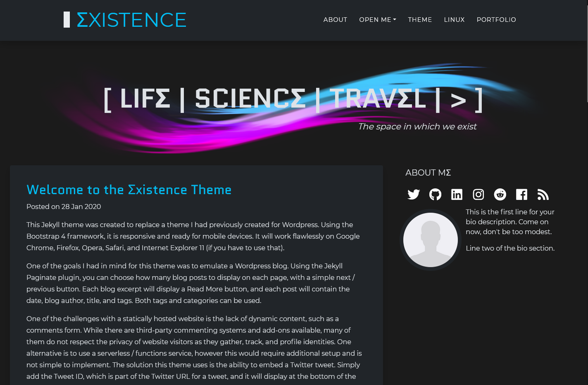

## Preview



## Background
For ten years I used the popular Wordpress platform for my personal [blog,](https://rayheffer.com) that was hosted on a hardened CentOS Linux virtual private server (VPS). While this served me well over the years, Wordpress has [294 known vulnerabilities](https://www.cvedetails.com/vulnerability-list/vendor_id-2337/product_id-4096/Wordpress-Wordpress.html) at the time of writng this, not including the myriad of vulnerable plugins often required to customize Wordpress. Vulnerabilities with Wordpress plugins are considered to be the most likely attack vector of Wordpress sites being compromised. Furthermore, when self-hosting a Wordpress blog on a virtual server, the administrative overhead of keeping it patched (OS, kernel, modules, etc.) and secure can be quite burdensome. In 2017 I [published](https://www.rayheffer.com/building-secure-wordpress-server-lamp-centos-7-selinux/) a lengthy blog post of building a secure server for Wordpress based on the LAMP stack.

In the end I decided to start over, and created this theme for Jekyll. 

### Static Sites
To kick off 2019 I decided to adopt a completely new approach to building and maintaining my [blog](https://www.rayheffer.com), using static sites. My requirements were:
* Serverless - Use static HTML and / or serverless functions
* Use Git - Two branches (master and develop)
* Open-source site code (HTML, CSS, JavaSCript) - GitHub
* CDN - Use a Content Deliver Network to ensure the site is as fast as possible no matter where visitors are located
* Custom theme - I wanted to build my own theme

## Features
* MIT License
* Built to support the latest, stable releases of all major browsers and platforms
* Fully responsive HTML template created with Bootstrap 4
* Responsive design with collapsing navigation, incuding dropdown menus and active page style
* About page
* Footer - Copyright and Privacy Policy
* SCSS files included for deeper customization options
* Embed Twitter (tweet) using TweetID for individual posts

## Usage

`_config.yml`
```
title: [The title of your site]
heading: [Main heading for site, displayed at the top]
subheading: [Italic sub-heading]
description: [Description of the site, for metatag]
```

`_data\default.yml'
```
brand:
  name: [Your Name, displayed on left of menu]

nav: [Menu Structure]
  - title: About
    url: '/about/'
    sublinks:
      - title: About Me
        url: '/about/'
      - title: Privacy Policy
        url: '/privacy/'   
  - title: Page 1
    url: '/page1/'
  - title: Page 2
    url: '/page2/'

menu-text: Menu [Displays text in collapsed form]

copyright: [Copyright text for footer]

social-buttons: [Used Font-Awesome to generate icons]
  - icon: fab fa-twitter
    url: 'https://<twitter-url>' 
  - icon: fab fa-github
    url: 'https://<github-url>'
  - icon: fab fa-linkedin
    url: 'https://<linkedin-url>'
  - icon: fas fa-rss
    url: '/feed.xml'
    
quicklinks: [Displayed in footer]
  - title: Privacy Policy
    url: '/privacy/'

## License

The theme is available as open source under the terms of the [MIT License](https://opensource.org/licenses/MIT).

